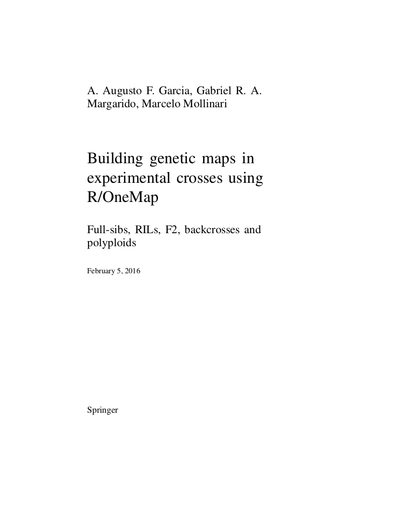

--- 
title       : LGN 5830 - Biometria de Marcadores Genéticos
subtitle    : INTRODUÇÃO
author      : Antonio Augusto Franco Garcia (http://augustogarcia.me)
job         : Departamento de Genética, ESALQ/USP (2019)
framework   : io2012        # {io2012, html5slides, shower, dzslides, ...}
highlighter : prettify  # {highlight.js, prettify, highlight}
hitheme     : solarized_light    # era tomorrow
linenums    : true
widgets     : [mathjax, bootstrap, quiz]   # {mathjax, quiz, bootstrap}
mode        : selfcontained # {selfcontained, standalone, draft}
--- 

# Apresentações

## Responsável

- Antonio Augusto Franco Garcia

## Monitores

- Kaio Graças Dias
- Letícia Castro Lara
- Rafael Nalin
- Gabriel Gesteira
- Jhonathan Pedroso
- Cristiane Taniguti

## Alunos e ouvintes

- Fale algo a seu respeito!

---

## Perfil heterogêneo...

- Buscamos excelência, alto nível de entendimento
- Literatura internacional
- **Genética Estatística (Statistical Genetics)** 

---

## Página na internet

[Biometria de Marcadores Genéticos](http://augusto-garcia.github.io/Biometria-de-Marcadores/)

---

## Conteúdo

- Mapas Genéticos
  - Tipos de marcadores: tradicionais e SNPs
  - Tipos de populações: RC, $F_2$, RILs, "outcrossing", DIII
  - Teste da segregação mendeliana
  - Análise de ligação (dois pontos, três pontos e multiponto)
  - Ordenação de locos

---

## Conteúdo (cont.)

- Mapeamento de QTL's
  - Análise de marcas individualmente
  - Mapeamento por Intervalo
  - Mapeamento por Intervalo Composto
  - Interação QTL x E
  - Mapeamento para Múltiplos Caracteres
  - Mapeamento de Múltiplos Intervalos
  - Modelos mistos e mapeamento

---

## Conteúdo (cont.)

- Mapeamento Associativo
  - Desequilíbrio de Ligação
  - Estrutura Populacional
  - Modelos de GWAS
- Seleção Genômica
  - Fundamentos
  - GBLUP
  - RRBLUP

---

## Conteúdo (cont.)

- Programas Principais
  - R
  - OneMap
  - R/qtl
  - Vários outros

---

# OneMap

## Muito usado, especialmente no exterior

- USP, UNICAMP, IAC, EMBRAPA
- CIAT, UC Davis, North Carolina State University, Duke University,
    Purdue University, Summer Institute in Statistical Genetics (UW),
    Kansas State Universiy, Universidad del Vale (Colombia),
    University of Missouri, UC Irvine, Chinese Academy of Fishery
    Sciences, Universidad de la Republica (Uruguay), USDA, University
    of California, Universitaet Hohenheim (Stuttgart, Germany),
    University of Texas, Technische Universität München, University of
    Stirling (Scotland), China Agriculture University, University of
    Georgia, New Zealand Institute for Plant and Food Research,
    University of Edinburgh, Université catholique de Louvain
    (Belgium), University of Oregon, Illinois State University, Orissa
    University of Agriculture and Technology (India), University of
    Chicago, CRA-GPG - Genomic Research Center, ...

---

## Livro

- 
- Augustanis, Gabrieles, Marcelitcho

---

## Livro



---

## OneMap

- [CRAN](http://cran.r-project.org/web/packages/onemap/index.html)
- Purdue University
- Summer Institute in Statistical Genetics (Seattle, USA; Piracicaba,
  SP, Brazil).
- OneMap, versão experimental no
[github](https://github.com/augusto-garcia/onemap)


---

## Reprodutibilidade

- Usaremos ferramentas que permitem isso
- Dados experimentais (vídeos, etc)
- Web
- Códigos para analisar os dados
  - [FOAS](http://www.foastat.org/)
  - [ggvis](http://ggvis.rstudio.com/)
  - [QTL](http://kbroman.org/qtlcharts/)
  - [Slides em html](http://statgen.esalq.usp.br/quantgen/)

---

## Bagunça vs Reprodutibilidade

- Você arruma sua casa antes de receber visitas?
- Você gostaria que alguém repetisse as análises que você fez na sua
tese?
- E nos artigos já publicados?

---

## Hoje temos muitas possibilidades

- Emacs + R + $BibTex$
- [RStudio](http://www.rstudio.com/): excelente
- [Código fonte](https://github.com/augusto-garcia/Biometria-de-Marcadores-Introduction) destes slides
- [Slides interativos](http://statgen.esalq.usp.br/quantgen/decomp-gen-value/#14)


---

# Plano de Ensino

## Parte didática

- Monitores: disponíveis para ajudar
- Ensino Dedutivo vs Indutivo
  - Deductive approach: General rule $\rightarrow$ Specific examples
    $\rightarrow$ Practice
  - Inductive approach: Specific examples $\rightarrow$ Practice
  $\rightarrow$ General rule
  

--- .segue .dark .quote

<q class = 'yellow'> Tell me and I forget, <br />
Teach me and I remember, <br />
Involve me and I learn.
<br />

</q>

<br />

- Benjamin Franklin (1706-90)

---

## Comprometimento

- Responsabilidade: alunos produtivos, proativos, engajados
- Cientistas: eternos aprendizes

---

## Estratégia: uso da internet, computação

- Tablets, smartphones, $\ldots$
- Internet ``Social''
- Meu [Lab](http://statgen.esalq.usp.br)

---

## Estaremos sempre em contato!

- Grupo no WhatsApp (participe!)
- Fórum no
  [Google Groups](https://groups.google.com/forum/#!forum/forum-biomarc-2015)
- Lista de emails (enviarei convites)
- [Mendeley](http://www.mendeley.com/profiles/a-augusto-f-garcia)

---

## (SEMPRE em contato!)

<iframe width="854" height="510" src="https://www.youtube.com/embed/OMOGaugKpzs" frameborder="0" allowfullscreen></iframe>

---


## Statistical Genetics

- Sendo bem sincero, não é simples
- Poucos conceitos podem fazer uma grande diferença

<iframe width="854" height="510"
src="https://www.youtube.com/embed/5pidokakU4I?list=RD5pidokakU4I"
frameborder="0" allowfullscreen></iframe>

---

## Conceitos e Avaliação

###  Participação no curso é fundamental (incluindo Forum, Comunidades, etc)


-  Listas de exercícios com **prazos para entrega**
  - Não imprimir, mandar apenas em PDF para
      _biometriamarcadores@gmail.com_
  - Use o Google Docs ou o $LaTeX$ (Uôrdi queima o seu filme, mas é válido)
  - (Opção avançada: _knitr_ com RStudio)
  - Muitos exercícios serão respondidos no Fórum diretamente
- Formem grupos de trabalho, por afinidade, com até 4 pessoas

---

## Primeiras Tarefas (para 13/03/19):

- Participe do grupo no WhatsApp
- Crie uma conta no [Mendeley](http://www.mendeley.com/), configure seu perfil e adicione-me
- Crie uma conta no [Gravatar](http://pt.gravatar.com/) e, obviamente, insira sua foto
- Inscreva-se no [Fórum da
  disciplina](https://groups.google.com/forum/#!forum/forum-biometria-de-marcadores-2019)
- Adicione-me no twitter: [@aafgarci](https://twitter.com/aafgarci)
- Use #biomarc nas postagens relacionadas à disciplina
- (Opcional: crie uma conta no [github](https://github.com) e adicione-me como contato)


---


```r
print(sessionInfo(), locale = FALSE)
```

```
## R version 3.5.2 (2018-12-20)
## Platform: x86_64-pc-linux-gnu (64-bit)
## Running under: Ubuntu 18.04.2 LTS
## 
## Matrix products: default
## BLAS: /usr/lib/x86_64-linux-gnu/blas/libblas.so.3.7.1
## LAPACK: /usr/lib/x86_64-linux-gnu/lapack/liblapack.so.3.7.1
## 
## attached base packages:
## [1] stats     graphics  grDevices utils     datasets  methods   base     
## 
## other attached packages:
## [1] ggplot2_3.1.0 slidify_0.5  
## 
## loaded via a namespace (and not attached):
##  [1] Rcpp_1.0.0       knitr_1.21       whisker_0.3-2    magrittr_1.5    
##  [5] tidyselect_0.2.5 munsell_0.5.0    colorspace_1.4-0 R6_2.4.0        
##  [9] rlang_0.3.1      highr_0.7        stringr_1.4.0    plyr_1.8.4      
## [13] dplyr_0.8.0.1    tools_3.5.2      grid_3.5.2       gtable_0.2.0    
## [17] xfun_0.5         withr_2.1.2      assertthat_0.2.0 yaml_2.2.0      
## [21] lazyeval_0.2.1   digest_0.6.18    tibble_2.0.1     crayon_1.3.4    
## [25] purrr_0.3.1      codetools_0.2-16 glue_1.3.0       evaluate_0.13   
## [29] labeling_0.3     stringi_1.3.1    compiler_3.5.2   pillar_1.3.1    
## [33] scales_1.0.0     markdown_0.9     pkgconfig_2.0.2
```

--- bg:#fee6ce

<q>OBRIGADO!</q>


